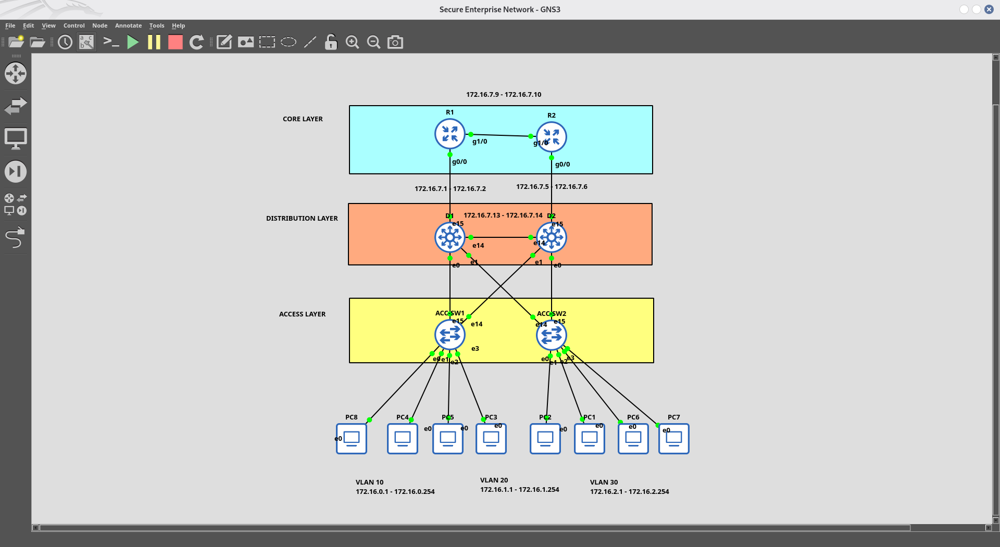

---

# 📁 Project 3: Secure Enterprise Network

## 📌 Project Overview
This project focuses on implementing a **defense-in-depth security architecture** for an enterprise network. Security controls are applied at **Layer 2 (switching)**, **Layer 3 (routing)**, and **management/infrastructure** layers to provide layered protections and operational visibility.

## 🎯 Objectives
- **Layer 2 Security:** Port Security, DHCP Snooping, Dynamic ARP Inspection (DAI)  
- **Layer 3 Security:** Extended ACLs for traffic filtering  
- **Management Security:** SSH, SNMPv3, NTP, Syslog  
- **Infrastructure Security:** BPDU Guard, Root Guard, Storm Control

---

## 📌 Table of Contents
1. Network Topology  
2. IP Addressing Scheme & HSRP Plan  
3. Golden Configs (Access / Core / Router)  
4. Verification Commands & Expected Outputs  
5. Screenshots (figures)  
6. Lessons Learned & Future Improvements  
7. GitHub Repository Structure

---

## 🏗️ Network Topology

Figure 1 shows the secure enterprise topology used during the lab (core router(s), distribution switches, access switches, VLANs and security controls).


*Figure 1 — Secure Enterprise Network (Core Router, Distribution Switch, Access Switches, VLANs 10/20/30, HSRP on core switches).* 

---

## 📊 IP Addressing Scheme

| VLAN | Network | Subnet Mask | Virtual Gateway (HSRP) | CORE-SW1 (Physical) | CORE-SW2 (Physical) |
|------|---------|-------------|------------------------:|---------------------:|---------------------:|
| **VLAN 10 (Mgmt)** | 172.16.0.0/24 | 255.255.255.0 | 172.16.0.1 | 172.16.0.2 | 172.16.0.3 |
| **VLAN 20 (HR)**   | 172.16.1.0/24 | 255.255.255.0 | 172.16.1.1 | 172.16.1.2 | 172.16.1.3 |
| **VLAN 30 (Guest)**| 172.16.2.0/24 | 255.255.255.0 | 172.16.2.1 | 172.16.2.2 | 172.16.2.3 |

### HSRP Priority Plan

| Switch | VLAN 10 | VLAN 20 | VLAN 30 |
|--------|:--------:|:--------:|:--------:|
| **CORE-SW1** | Active (150) | Active (150) | Standby (100) |
| **CORE-SW2** | Standby (100) | Standby (100) | Active (150) |

---

## 🔧 Updated Configuration Codes (Golden Configs)

### 1. Access Switches (`ACC-SW1` & `ACC-SW2`)
```
enable
configure terminal

! 1. VLAN Creation
vlan 10
 name VLAN10_Mgmt
vlan 20
 name VLAN20_HR
vlan 30
 name VLAN30_Guest
exit

! 2. Uplinks to Core Switches (Gi3/2 & Gi3/3)
interface range gi3/2 - 3
 switchport trunk encapsulation dot1q
 switchport mode trunk
 switchport trunk native vlan 1
 switchport trunk allowed vlan 10,20,30
 no spanning-tree bpduguard enable
 no switchport port-security
 ip dhcp snooping trust
 ip arp inspection trust
 no shutdown
exit

! 3. Access Ports Configuration
interface range gi0/0 - 3, gi1/0 - 3
 switchport mode access
 switchport access vlan 10
 spanning-tree portfast
 spanning-tree bpduguard enable
 switchport port-security
 switchport port-security maximum 2
 switchport port-security violation shutdown
 switchport port-security mac-address sticky
 no shutdown
exit

interface range gi2/0 - 3
 switchport mode access
 switchport access vlan 20
 spanning-tree portfast
 spanning-tree bpduguard enable
 no shutdown
exit

interface range gi3/0 - 1
 switchport mode access
 switchport access vlan 30
 spanning-tree portfast
 spanning-tree bpduguard enable
 no shutdown
exit

! 4. DHCP Snooping
ip dhcp snooping
ip dhcp snooping vlan 10,20,30
no ip dhcp snooping information option

! 5. DAI Disabled (to fix ping issues)
no ip arp inspection vlan 10,20,30

end
write memory
```

---

### 2. Core Switch 1 (`CORE-SW1` — HSRP Active for VLAN 10, 20)
```
enable
configure terminal

! 1. Layer 3 SVI & HSRP Setup
interface Vlan10
 ip address 172.16.0.2 255.255.255.0
 standby 10 ip 172.16.0.1
 standby 10 priority 150
 standby 10 preempt
 no shutdown
exit

interface Vlan20
 ip address 172.16.1.2 255.255.255.0
 standby 20 ip 172.16.1.1
 standby 20 priority 150
 standby 20 preempt
 no shutdown
exit

interface Vlan30
 ip address 172.16.2.2 255.255.255.0
 standby 30 ip 172.16.2.1
 standby 30 priority 100
 no shutdown
exit

! 2. DHCP Server Configuration
service dhcp
ip dhcp excluded-address 172.16.0.1 172.16.0.10
ip dhcp excluded-address 172.16.1.1 172.16.1.10
ip dhcp excluded-address 172.16.2.1 172.16.2.10

ip dhcp pool VLAN10
 network 172.16.0.0 255.255.255.0
 default-router 172.16.0.1
 dns-server 8.8.8.8
exit

ip dhcp pool VLAN20
 network 172.16.1.0 255.255.255.0
 default-router 172.16.1.1
 dns-server 8.8.8.8
exit

ip dhcp pool VLAN30
 network 172.16.2.0 255.255.255.0
 default-router 172.16.2.1
 dns-server 8.8.8.8
exit

! 3. DHCP Option 82 Bypass
ip dhcp relay information trust-all
no ip dhcp snooping information option

! 4. Uplinks Trust
interface range gi0/0 - 1
 ip dhcp snooping trust
 ip arp inspection trust
exit

end
write memory
```

---

### 3. Core Switch 2 (`CORE-SW2` — HSRP Active for VLAN 30)
(Configurations mirror CORE-SW1 with HSRP priorities adjusted so CORE-SW2 is active for VLAN 30.)

---

### 4. Core Router (`CORE-Router-1` — SSH, SNMPv3, NTP, Syslog)
```
enable
configure terminal
hostname CORE-Router-1

! 1. SSH Configuration
ip domain-name secure.local
crypto key generate rsa modulus 2048
ip ssh version 2
ip ssh authentication-retries 3
ip ssh time-out 60

username admin secret Cisco123!
line vty 0 4
 transport input ssh
 login local
 exec-timeout 10 0
 logging synchronous
exit

! 2. SNMPv3 Configuration
snmp-server group SECURE v3 priv
snmp-server user admin SECURE v3 auth sha Cisco123! priv aes 128 Cisco123!
snmp-server view ALL iso included
snmp-server enable traps
snmp-server host 172.16.0.100 version 3 priv admin udp-port 162

! 3. NTP Configuration
ntp server 172.16.0.1
ntp source loopback 0
ntp authentication-key 1 md5 Cisco123!
ntp trusted-key 1
ntp authenticate

! 4. Syslog Configuration
logging on
logging host 172.16.0.100
logging trap debugging
logging source-interface loopback 0
logging buffered informational

end
write memory
```

---

## ✅ Verification Commands & Expected Outputs

(Condensed list — run these on respective devices to validate configuration and services.)

- Access Switches
  - show interface trunk — Verify trunk links (Gi3/2, Gi3/3 trunking)
  - show port-security — Port security status (Max 2, Sticky MACs)
  - show ip dhcp snooping — DHCP snooping status (Enabled, Trusted uplinks)
  - show ip arp inspection interfaces — DAI interface status
  - show interface status err-disabled — Error-disabled ports

- Core Switches
  - show standby brief — HSRP status (Active/Standby)
  - show ip dhcp binding — DHCP leases
  - show ip dhcp pool — DHCP pool stats
  - show interface trunk — Trunk status (Gi0/0-1)
  - show ip dhcp snooping — DHCP snooping summary

- Core Routers
  - show ip ospf neighbor — OSPF adjacency (FULL)
  - show ip route ospf — OSPF routes
  - show logging — Syslog status
  - show ip ssh — SSH status (v2, RSA 2048)
  - show ntp status — NTP sync (Clock is synchronized)

- End Hosts
  - ip dhcp — DHCP request (IP assigned)
  - ping 172.16.0.1 — Gateway reachable (!!!!!)

---

## 📸 Figures / Screenshots

Below are embedded screenshots from the repo to make verification and reports visually clear. (Images are referenced relative to repository paths.)

Figure 2 — Port Security / Sticky MACs (Access Switch 1)  
  
Command: show port-security

Figure 3 — DHCP Snooping Operational Status & Trusted Uplinks (Access Switch 1)  
  
Command: show ip dhcp snooping

Figure 4 — HSRP Active/Standby Status (CORE-SW1)  
  
Command: show standby brief

Figure 5 — Active DHCP Server Pool Bindings (CORE-SW1)  
  
Command: show ip dhcp binding

Figure 6 — SSH v2 Status & RSA Keys Verification (CORE-Router-1)  
  
Command: show ip ssh

Figure 7 — Syslog & Remote Server Logging Status (CORE-Router-1)  
  
Command: show logging

Figure 8 — NTP Clock Synchronization & Peer Status (CORE-Router-1)  
  
Command: show ntp status

Figure 9 — Interface Trunk & VLAN Forwarding (CORE-SW1)  
  
Command: show interface trunk

Figure 10 — End-to-End Ping Test (example)  
(Use a representative ping screenshot if available under Screenshots/ACCESS-SW1 or End Device folders; if not present, capture and add ping output to Screenshots/End Device.)  
Command: ping 172.16.0.1

Notes:
- I embedded the screenshots that are currently present under Screenshots/* directories. If you want additional screenshots (e.g., explicit SNMPv3 show commands), capture the relevant output and add it to Screenshots/, then reference it here.
- Captions show the verification command so readers know which CLI output corresponds to each figure.

---

## 📚 Lessons Learned

| Issue | Solution |
|-------|----------|
| **BPDU Guard** on trunk ports causing err-disable | Remove BPDU Guard on uplink trunks |
| **DAI blocking ARP** causing ping failures | Disable DAI or trust uplink interfaces |
| **DHCP Option 82 drops** in GNS3 | `no ip dhcp snooping information option` |
| **Duplicate IP conflict** on SVIs | Unique physical IPs, common Virtual IP |
| **HSRP not forming** | Preempt with correct priorities |

---

## 🚀 Future Improvements
- Implement **AAA (TACACS+)** for centralized authentication.  
- Deploy **IPS/IDS** for threat detection.  
- Implement **802.1X** for port-based authentication.  
- Add **Firewall** integration and further monitoring dashboards.

---

## 🏆 LinkedIn Post (ready)
> **"🔐 Project 3: Secure Enterprise Network Completed!**  
>  
> **✅ Layer 2 Security:** Port Security, DHCP Snooping  
> **✅ Layer 3 Security:** Extended ACLs  
> **✅ Management Security:** SSH, SNMPv3, NTP, Syslog  
> **✅ Infrastructure Security:** BPDU Guard, Storm Control  
>  
> **🔐 Defense-in-Depth strategy implemented!**  
>  
> **#Cybersecurity #NetworkSecurity #CCNA #GNS3 #Cisco #Security"**

---

## 📂 GitHub Repository Structure
```
Project3-Secure-Enterprise/
├── README.md
├── configs/
│   ├── ACC-SW1.txt
│   ├── ACC-SW2.txt
│   ├── CORE-SW1.txt
│   ├── CORE-SW2.txt
│   └── CORE-Router-1.txt
├── Screenshots/
│   ├── ACCESS-SW1/
│   │   ├── 1. Trunk Links Verification .png
│   │   ├── 2. Port Security & Sticky MAC Addresses.png
│   │   ├── 3. DHCP Snooping Operational Status & Trusted Uplinks.png
│   │   ├── 4. Dynamic ARP Inspection (DAI) Statistics & Trusted Interfaces.png
│   │   └── 5. Err-disabled Interfaces Status Check (Should be clean empty).png
│   ├── ACCESS-SW2/
│   ├── Core-SW1/
│   ├── Core-Router1/
│   ├── Core-Router2/
│   └── Topology-Network/
│       ├── network-topology-main.png
│       ├── network-topology-v2.png
│       ├── network-topology-v3.png
│       └── network-topology-v4.png
└── topology/
    └── network-diagram.png
```

---
